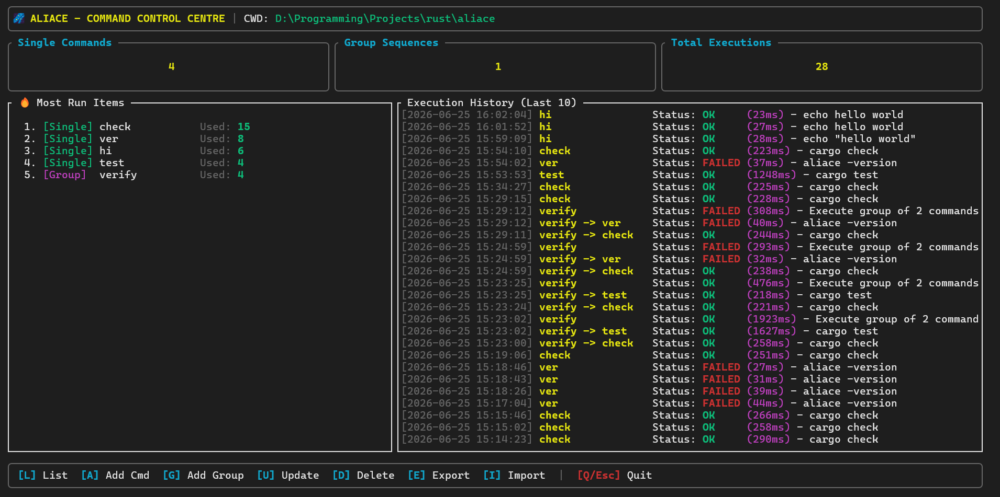

# Aliace

Aliace is a fast, lightweight, and keyboard-driven command-line command and sequence group manager built in Rust with `ratatui` and `crossterm`. 

It enables developers to save long, complex terminal commands, organize them into sequential execution groups, monitor run statistics, and run them either interactively via a beautiful TUI or directly through CLI scripting.



---

## 🚀 Installation & Setup

### Prerequisites
You need the [Rust toolchain (cargo)](https://rustup.rs/) installed on your machine.

### 1. Build the Binary
Clone the repository, navigate to the directory, and compile in release mode:
```powershell
cargo build --release
```

The compiled release executable will be generated at:
* **Windows**: `target/release/aliace.exe`
* **macOS/Linux**: `target/release/aliace`

### 2. Install to PATH
To run `aliace` from any terminal directory, add the compiled binary to your system's PATH.

#### Windows (PowerShell):
```powershell
# Copy to a folder in your PATH, e.g., a custom binaries directory
Copy-Item target\release\aliace.exe -Destination "$env:USERPROFILE\aliace\bin\"
```
Then Setup `Environment Variable`

#### macOS / Linux:
```bash
# Copy to /usr/local/bin or ~/.local/bin
cp target/release/aliace /usr/local/bin/
```

---

## 📖 How to Use

Aliace has two modes of operation: **Interactive TUI** and **CLI Scripting**.

### 1. Interactive TUI
Launch the full dashboard to visually manage and trigger commands:
```bash
aliace
```

Or open the TUI directly to a specific screen:
* `aliace list` - Interactive list & manage screen
* `aliace add` - Interactive screen to register a new command
* `aliace update` - Select and edit registered commands/groups
* `aliace delete` - Select and delete registered commands/groups
* `aliace export` - Visual backup exporter
* `aliace import` - Visual backup importer

### 2. CLI Scripting
Execute commands or manage database entries directly from your shell/scripts without entering the TUI:
```bash
# Execute a command or group sequence directly
aliace run <title>

# Add a single command via CLI
aliace command add --title "build" --script "cargo build --release" --desc "Build release binary"

# Add a group sequence via CLI
aliace group add --name "deploy" --desc "Build & Test sequence" --commands "build,test"
```

For detailed usage guidelines on TUI navigation, shortcuts, and CLI scripting options, please refer to the [Usage Guide](docs/USAGE.md).
