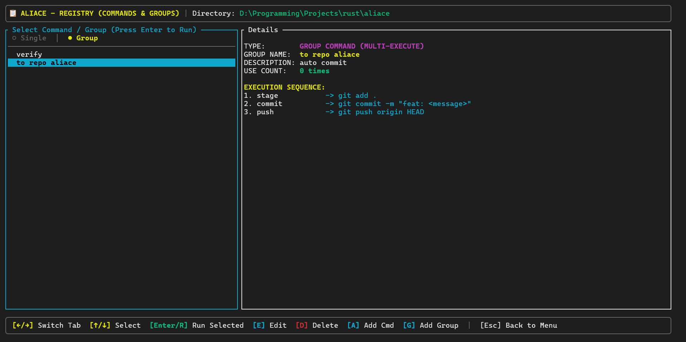

# Aliace


Aliace is a high-performance, keyboard-driven command registry and execution orchestration utility designed to streamline developer workflows and automate command execution. Built in Rust, Aliace delivers a responsive Terminal User Interface (TUI) alongside a robust Command Line Interface (CLI) for headless scripting and automation.

Aliace enables software engineers and system administrators to catalog complex shell commands, orchestrate sequential execution groups, capture execution telemetry, and define dynamic parameter bindings—all backed by a lightweight, portable JSON registry.



---

## 🔑 Key Features & Business Value

* **Unified Command Registry**: Eliminate command fragmentation by maintaining a single, local JSON-serialized database of frequently used commands.
* **Orchestration & Workflow Pipelines**: Group commands into sequential, ordered execution pipelines. Pipelines stop immediately if any step fails (non-zero exit code), ensuring system safety.
* **Dynamic Parameter Binding**: Enclose command placeholders in angle brackets (e.g., `<branch>`, `<message>`) to prompt the operator for inputs dynamically during execution.
* **Execution Telemetry & Analytics**: Gain insight into operational history with usage counts, duration logs, and execution status tracking.
* **Dual Operation Mode**: Seamlessly transition from a visual, interactive dashboard TUI to a scripting-friendly CLI interface.
* **Zero Dependency musl Binaries**: Cross-compile to standalone binaries with no runtime dependencies, simplifying enterprise distribution.

---

## 🚀 Installation & Deployment

### Prerequisites
Compilation requires the [Rust toolchain](https://rustup.rs/) (Cargo) to be configured on the host machine.

### 1. Compilation
Clone the repository and compile the binaries using the release profile:
```powershell
cargo build --release
```

The optimized, target-specific binary is compiled to:
* **Windows**: `target/release/aliace.exe`
* **macOS/Linux**: `target/release/aliace`

### 2. Path Configuration
To invoke `aliace` globally, add the compiled binary to your system path.

#### Windows (PowerShell):
```powershell
# Deploy the executable to a custom binary directory in your system PATH
Copy-Item target\release\aliace.exe -Destination "$env:USERPROFILE\bin\"
```
then setup `Environment Variables`

#### macOS / Linux:
```bash
# Move the compiled binary to a shared user bin folder
cp target/release/aliace /usr/local/bin/
```

---

## 📖 Operational Overview

### 1. Interactive Dashboard (TUI)
Launch the visual management dashboard by executing `aliace` with no arguments:
```bash
aliace
```
You can also launch directly into sub-panels (e.g., `aliace list`, `aliace add`, `aliace update`, `aliace delete`, `aliace export`, `aliace import`).

### 2. Headless Automation (CLI)
Automate registry administration or trigger workflows directly in CI/CD pipelines or shell scripts:
```bash
# Execute a single command or pipeline group directly
aliace run <title_or_name>

# Register a command programmatically
aliace command add --title "build" --script "cargo build --release" --desc "Compile release binary"

# Assemble a pipeline group programmatically
aliace group add --name "deploy" --desc "Build and run integration tests" --commands "build,test"
```

For complete instructions on interactive hotkeys, dynamic argument prompt usage, and administrative CLI flags, refer to the [Operational Reference Guide](docs/USAGE.md).
